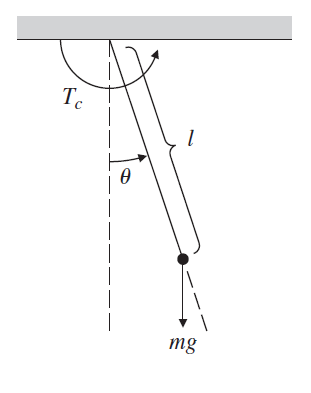
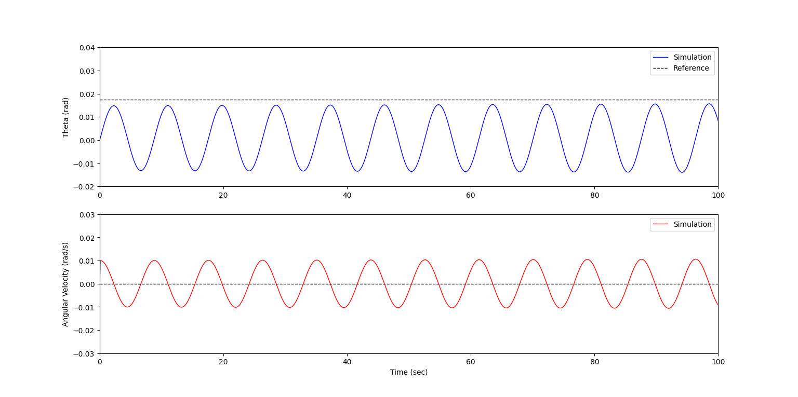
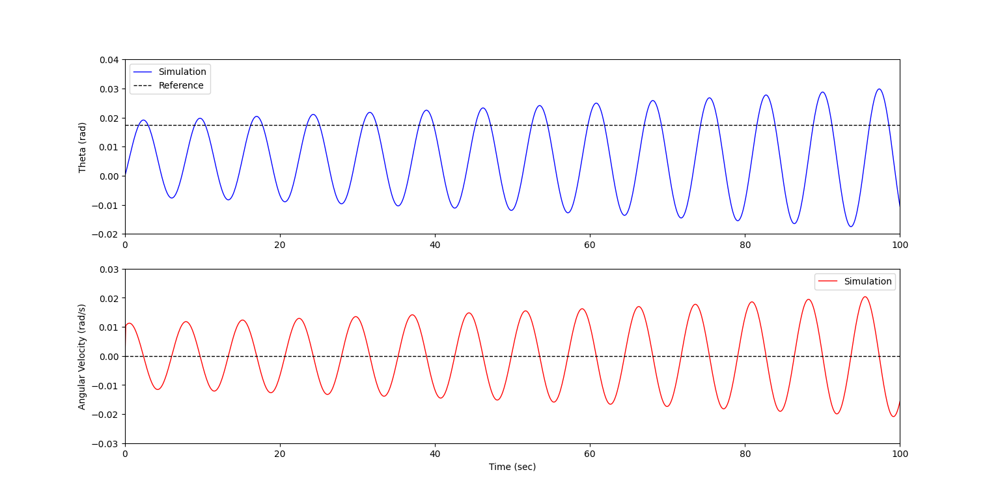
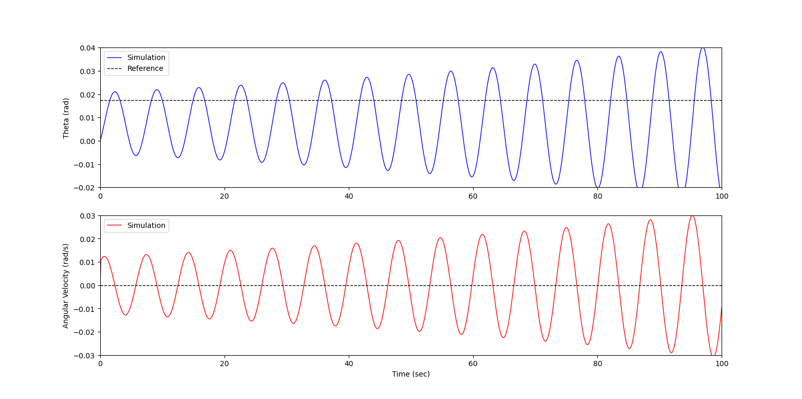
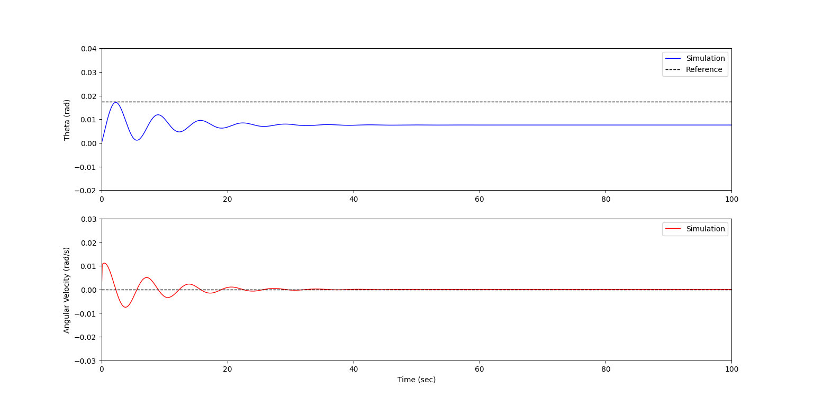
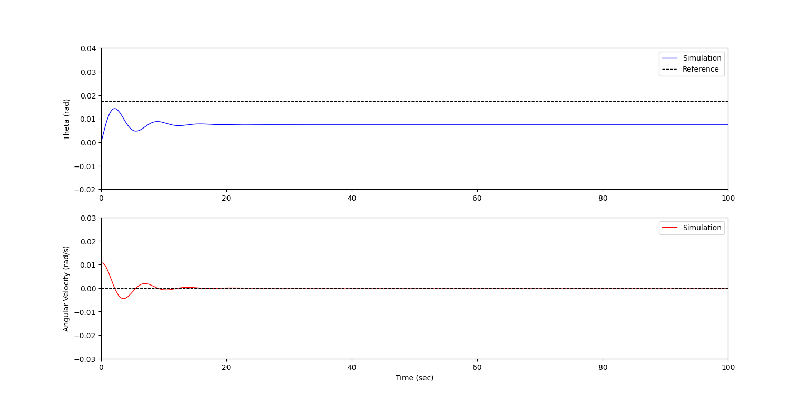
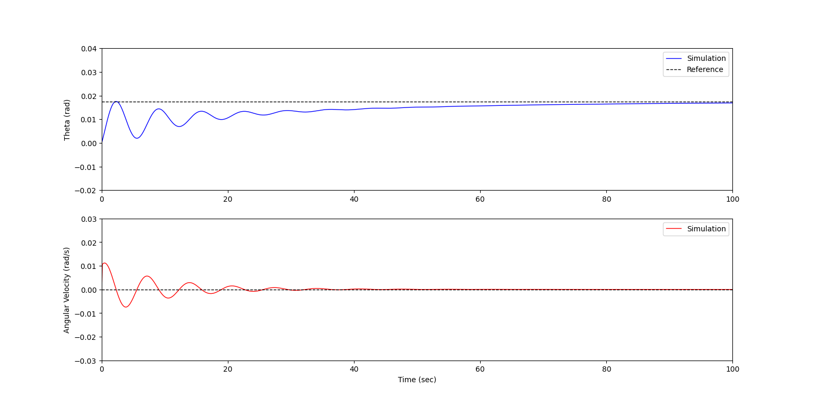
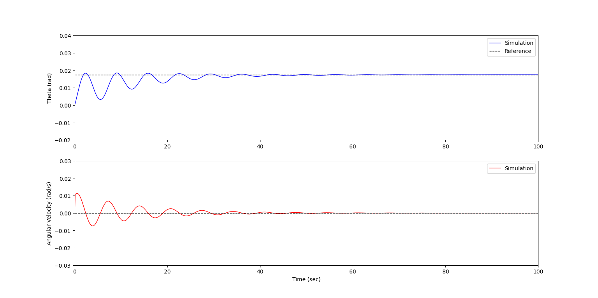
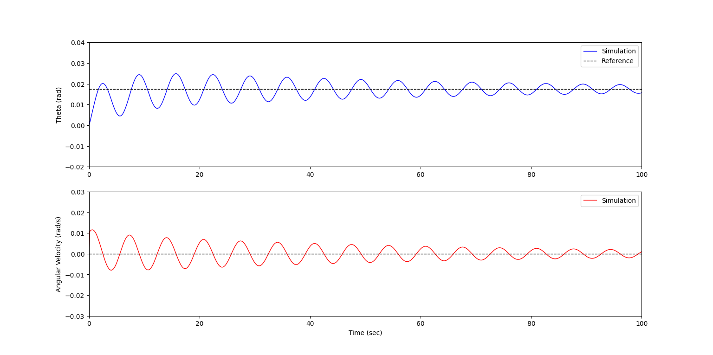

# PID Simulation of Pendulum System

System equation : $\ddot{\theta}+\frac{g}{l}\sin\theta=\frac{T_c}{ml^2}$

Use $l=20m$,$m=0.1kg$ and $g=9.81m/sec^2$

Initial state : position = 0 rad, angular velocity = 0.1 rad/s
## P Control
### 1. K = (1, 0, 0)

### 1. K = (10, 0, 0)

### 1. K = (15, 0, 0)

Proportional gain을 증가시킴에 따라 state variable의 진폭이 점점 커지는 것을 확인할 수 있다.

System Equation에 $\dot{\theta}$ 항이 없는 관계로 damping이 존재하지 않기 때문에 P control 만으로는 수렴하지 못하고 발산함을 알 수 있다

Damping을 위한 추가적인 제어 입력을 필요로 한다.

## PD Control
### 1. K = (15, 0, 3)

### 1. K = (15, 0, 10)

### 1. K = (15, 0, 20)

P gain 만으로 구성된 제어기에 derivative gain을 추가하여 PD controller를 시뮬레이션 한 결과 state variable이 수렴하는 모습을 보인다.

D gain이 증가함에 따라 P gain이 유발하는 oscillation을 잘 잡아주는 효과가 있다.

다만 reference 값과 steady-state 값 간의 차이가 나타나는데, steady-state error를 제거하기 위한 추가적인 gain을 필요로 한다.

## PID Control
### 1. K = (15, 1, 10)

### 1. K = (15, 3, 10)

### 1. K = (15, 7, 10)

P, D gain으로 구성된 제어기에 integral gain을 추가하여 PID controller를 시뮬레이션 한 결과 steady-state error가 제거된 모습을 보인다.

I gain을 증가시킴에 따라 응답 속도 자체는 빨라지는 모습을 보이나, 과도하게 증가시키는 경우 oscillation을 증가시켜 오히려 settling time이 늦어지는 결과를 초래할 수 있다.

따라서 적절한 I gain 값을 지정하는 과정이 필요할 것으로 보인다.